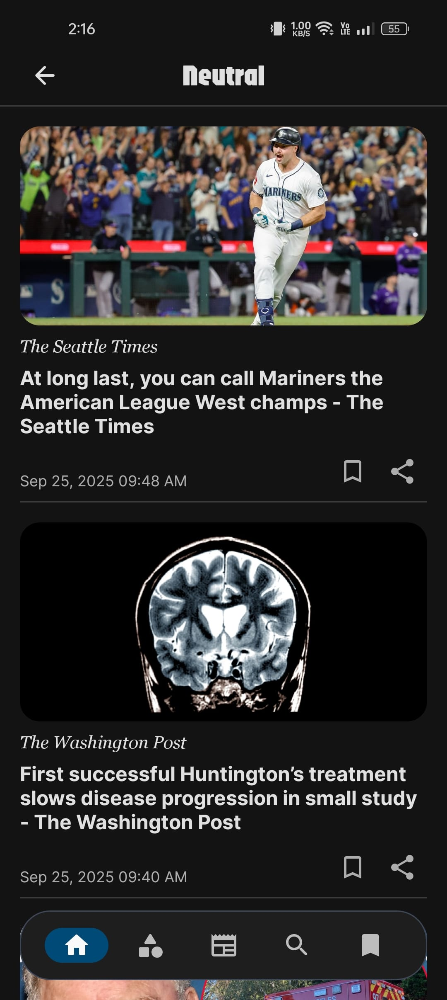
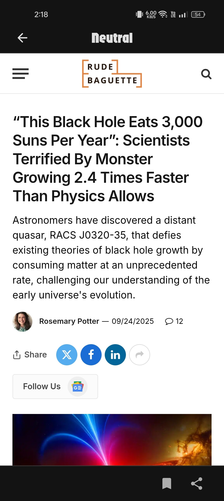

# Neutral: News App 📰

An Android news application implemented using the MVVM pattern, Retrofit2, Paging3, Dagger-Hilt,
Flow, ViewModel, Coroutines, Room, Navigation Components, View Binding and some other libraries from
the [Android Jetpack] . Neutral app fetches data from the [NewsAPI] .

## Technologies used:

* [Kotlin](https://kotlinlang.org/) - First class and official programming language for Android
  development.
* [Retrofit](https://square.github.io/retrofit/) a REST Client for Android which makes it relatively
  easy to retrieve and upload JSON (or other structured data) via a REST based webservice.
* [Dagger Hilt](https://dagger.dev/hilt/) for dependency injection.
* [ViewModel](https://developer.android.com/topic/libraries/architecture/viewmodel) to store and
  manage UI-related data in a lifecycle conscious way.
* [Flow](https://developer.android.com/kotlin/flow) for handling asynchronous data streams.
* [Navigation Component](https://developer.android.com/guide/navigation) to handle all navigation
  and also passing of data between destinations.
* [Material Design](https://m3.material.io/) an adaptable system of guidelines, components, and
  tools that support the best practices of user interface design.
* [Coroutines](https://kotlinlang.org/docs/reference/coroutines-overview.html) Coroutines help in
  managing background threads and reduces the need for callbacks.
* [Room](https://developer.android.com/topic/libraries/architecture/room) persistence library which
  provides an abstraction layer over SQLite to allow for more robust database access while
  harnessing the full power of SQLite.
* [Paging Library](https://developer.android.com/topic/libraries/architecture/paging/v3-overview)
  helps you load and display small chunks of data at a time.
* [Coil](https://coil-kt.github.io/coil/) - An image loading library for Android backed by Kotlin
  Coroutines.
* [Firebase](https://firebase.google.com/) - is a platform developed by Google for creating mobile
  and web applications.

## App Icon 📱

## Some Screenshots

  
  

  
  

## Download APK

[Android Jetpack]: https://developer.android.com/jetpack

[NewsAPI]: https://newsapi.org/
